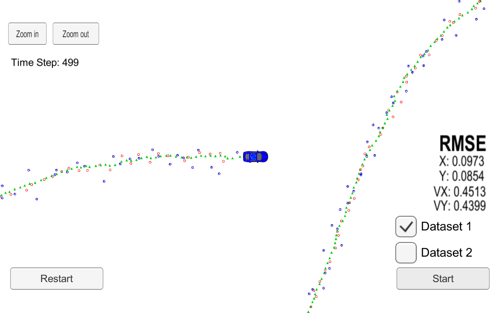

# Extended Kalman Filters

The presented project combines the data collected by LASER and RADAR sensors to locate obstacles encountered by a car while driving through a pathway.

This project is part of Udacity's Self Driving Car Engineer Nanodegree and needs the simulator provided by Udacity to execute the project.

## Contents

Some of the important files and folders are listed below:

**/src**
- The src folder consists of the following important .cpp files:
    - FusionEKF.cpp
        - implementation of Fusing the measurements of the two sensors by the aid of Kalman Filters
    - kalman_filter.cpp
        - implementation of **Predict** and **Update** cycle of Kalman Filters for both LASER and RADAR sensors
    - main.cpp
        - main procedure of the project
    - tools.cpp
        - implementation of calculation of RMSE & Jacobian Matrix for Extended Kalman Filter for the RADAR sensor data
    - /Eigen
        - This folder consists of Eigen package used for Matrix and Vector based operations

**/Debug**
- This folder consists of the shell script ExtendedKF.sh to execute the Kalman Filter

**/data**
- Consists of file **obj_pose-laser-radar-synthetic-input.txt** which contains the sensor measurements from LASER and RADAR sensors

**CmakeLists.txt**
- Cmake List File

**ExtendedKF.xcodeproj**
- Xcode IDE project file used to build the project files

## Usage

1. Run the ExtendedKF shell script located in **Debug** folder.
2. Run the Udacity's simulator and select the 'Extended KF Project'.
3. Select Dataset1 and click on 'Start' button in the simulator window.
4. The simulator will run and display the RMSE while the State and Co-variance matrix will be displayed in the console.

## Observations

- The RMSE values with both LASER and RADAR sensors and RMSE with only one individual sensor are as follows:

|Case  |Px    |Py    |Vx    |Vy    |
|------|------|------|------|------|
|LASER |0.1473|0.1153|0.6383|0.5346|
|RADAR |0.2261|0.3450|0.6441|0.7650|
|BOTH  |0.0973|0.0854|0.4513|0.4399|

- In the above table we can clearly see that the performance of the individual sensors is less than the combination of both.
- LASER sensor has a better sense of position than the RADAR sensor and the RMSE is somewhat closer to the combined sensor RMSE.
- In terms of velocity the data for the sensors operating solely is somewhat similar but not upto the mark of the combined effect.

## Conclusion

- The project clearly indicates that the combination of sensors is the optimum way to gather information about obstacles around the Self Driving Car and Kalman Filter is the optimum way for Sensor Fusion.
- We have prevented unecessary updation of state and co-variance matrix when the state parameters px and py is zero which have improved the RMSE for the filters.
- Further skipping the prediction state when a sensor measurement arrives at the same time of the previous sensor measurement that is difference between timestamps of two sensor measurements is zero. This has helped in reduction of unecessary calculations.

**Some Observed Demerits**
- There is certain data which is hardcoded (like the acceleration noise) which would not be a good practice for an actual Self Driving Car because the acceleration won't be constant at all times. If the car moves in reverse direction the acceleration will be in a total opposite direction of the hardcoded value.
